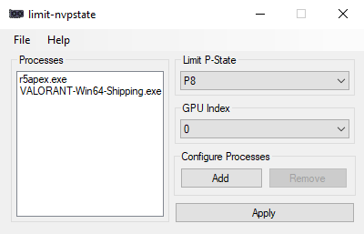

# limit-nvpstate

Limit P-States on NVIDIA GPUs when a user-defined list of processes are not running to reduce power consumption

This program acts as a lightweight alternative to NVIDIA Inspector's Multi-Display Power Saver feature. Note that closing the application by clicking "X" will unlimit P-States before closing. If the program ends abruptly (ending the process in task manager), the unlimit action will not be executed when exiting. limit-nvpstate uses [NVIDIA Inspector](https://www.techpowerup.com/download/nvidia-inspector) to change P-States.
